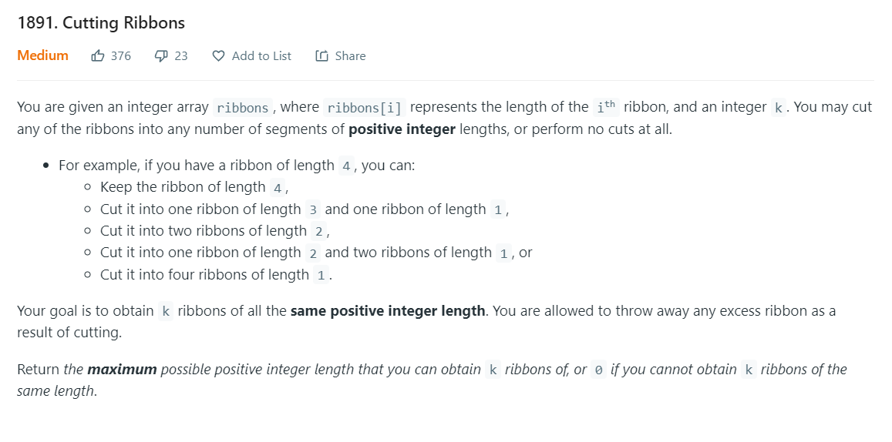
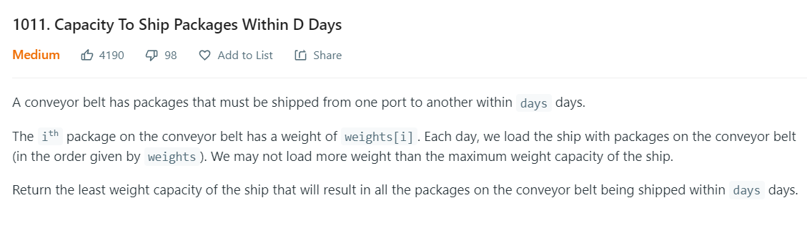
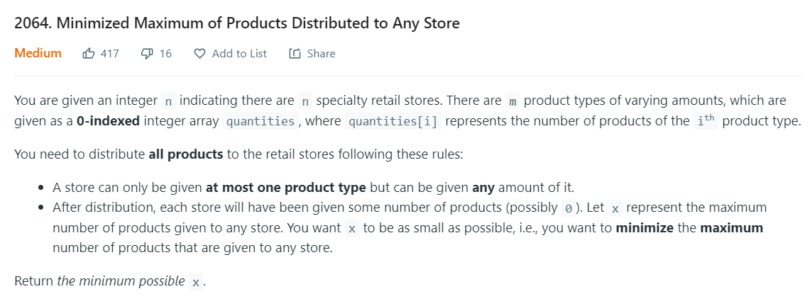

# Binary Search related questions

---

- [1891 | Cutting Ribbons](https://leetcode.com/problems/cutting-ribbons/)

  - [solution](../../Solutions/1891_Cutting%20Ribbons.py)

- [1011 | Capacity To Ship Packages Within D Days](https://leetcode.com/problems/capacity-to-ship-packages-within-d-days/)

  - [solution](../../Solutions/1011_Capacity%20To%20Ship%20Packages%20Within%20D%20Days.py)

- [2064 | Minimized Maximum of Products Distributed to Any Store](https://leetcode.com/problems/minimized-maximum-of-products-distributed-to-any-store/)

  - [solution](../../Solutions/2064_Minimized%20Maximum%20of%20Products%20Distributed%20to%20Any%20Store.py)

- [1231 | Divide Chocolate](https://leetcode.com/problems/divide-chocolate/)

  - [solution](../../Solutions/1231_Divide%20Chocolate.py)

- [875 | Koko Eating Bananas](https://leetcode.com/problems/koko-eating-bananas/)

  - [solution](../../Solutions/875_Koko%20Eating%20Bananas.py)

- [2226 | Maximum Candies Allocated to K Children](https://leetcode.com/problems/maximum-candies-allocated-to-k-children/)

  - [solution](../../Solutions/2226_Maximum%20Candies%20Allocated%20to%20K%20Children.py)

---

## Summary

Questions which could be solved by performing Binary Search has a pretty common pattern. By practicing 3 of them, you will get
pretty familiar with this kind of questions, they are just too similar, looks like one same question.

- Basically it has an array with weights of something.
- It has a limit integer which could be # of groups to split, capacity, etc.
- Finally it asks for minimum or maximum of something that satisfy the second limit above.

To give you a clearer sense of this kind of questions, here are some of the examples:

### To solve these questions:

- In short, We perform Binary Search.
- Be familiar with Binary Search, especially what left pointer and right pointer represent when we break the `while left <= right` loop.
- Write a function to calculate the mid value's corresponding result of the limit integer in each iteration. Note that this function often need to traverse the whole weights array, which could be a barrier for us to come up with, cause we usually expect to find a more efficient way when we are solving Leetcode questions.
